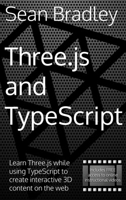

# Ball VR

A ball rolling experiment in VR.

Playable Demo : [https://ball-vr.sbcode.net](https://ball-vr.sbcode.net)

### Desktop

-   Drive : WASD
-   Brakes : SPACE
-   Look : MOUSE
-   Shoot : Left Mouse Click
-   Respawn : R

### Mobile

-   Left XY Controller : Drive, Tap to shoot
-   Right XY Controller : Look, Aim, Tap to shoot

## Develop

1. Clone Repository

```bash
git clone https://github.com/Sean-Bradley/Ball-VR.git
```

2. CD into folder

```bash
cd Ball-VR
```

3. Install TypeScript

```bash
npm install -g typescript
```

4. Install dependencies

```bash
npm install
```

5. Start it

```bash
npm run dev
```

6. Open browser and visit https://127.0.0.1:8080

Note that it creates a self certified SSL cert for your dev environment.

If you are accessing your dev server across a network, then you will need to allow access to port 8080 on your development machine.

I use Windows 11 with my dev setup, i have allowed connections to port 8080 using the Window Defender Firewall (Advanced Settings) and I can can connect to my dev servers network IP address, eg https://192.168.1.123:8080 using the Quest 2 browser.

For more in depth information on production server deployment options, such as SSL, Domain name & Cloud hosting, visit [https://sbcode.net/threejs/nginx-host/](https://sbcode.net/threejs/nginx-host/)

## Support

To help support my free projects, please take a look at my **ThreeJS and TypeScript** Book



&nbsp;<a href="https://www.amazon.com/dp/B09GYTKRCH">&nbsp; https://www.amazon.com/dp/B09GYTKRCH</a><br/>
&nbsp;<a href="https://www.amazon.co.uk/dp/B09GYTKRCH">&nbsp; https://www.amazon.co.uk/dp/B09GYTKRCH</a><br/>
&nbsp;<a href="https://www.amazon.in/dp/B09GYTKRCH">&nbsp; https://www.amazon.in/dp/B09GYTKRCH</a><br/>
&nbsp;<a href="https://www.amazon.de/dp/B09GYTKRCH">&nbsp; https://www.amazon.de/dp/B09GYTKRCH</a><br/>
&nbsp;<a href="https://www.amazon.fr/dp/B09GYTKRCH">&nbsp; https://www.amazon.fr/dp/B09GYTKRCH</a><br/>
&nbsp;<a href="https://www.amazon.es/dp/B09GYTKRCH">&nbsp; https://www.amazon.es/dp/B09GYTKRCH</a><br/>
&nbsp;<a href="https://www.amazon.it/dp/B09GYTKRCH">&nbsp; https://www.amazon.it/dp/B09GYTKRCH</a><br/>
&nbsp;<a href="https://www.amazon.nl/dp/B09GYTKRCH">&nbsp; https://www.amazon.nl/dp/B09GYTKRCH</a><br/>
&nbsp;<a href="https://www.amazon.co.jp/dp/B09GYTKRCH">&nbsp; https://www.amazon.co.jp/dp/B09GYTKRCH</a><br/>
&nbsp;<a href="https://www.amazon.ca/dp/B09GYTKRCH">&nbsp; https://www.amazon.ca/dp/B09GYTKRCH</a><br/>
&nbsp;<a href="https://www.amazon.com.br/dp/B09GYTKRCH">&nbsp; https://www.amazon.com.br/dp/B09GYTKRCH</a><br/>
&nbsp;<a href="https://www.amazon.com.mx/dp/B09GYTKRCH">&nbsp; https://www.amazon.com.mx/dp/B09GYTKRCH</a><br/>
&nbsp;<a href="https://www.amazon.com.au/dp/B09GYTKRCH">&nbsp; https://www.amazon.com.au/dp/B09GYTKRCH</a>

and my **ThreeJS and TypeScript** courses at [Udemy](https://www.udemy.com/course/threejs-tutorials/?referralCode=4C7E1DE91C3E42F69D0F), [YouTube (Channel membership required)](https://www.youtube.com/playlist?list=PLKWUX7aMnlEKTmkBqwjc-tZgULJdNBjEd) and [Skillshare](https://skl.sh/2uxctEP)

This is only just the beginning of what you will create.

**Course Discount Coupons** : https://sbcode.net/coupons#threejs

[](https://youtu.be/fS4H7gm7gK4)
